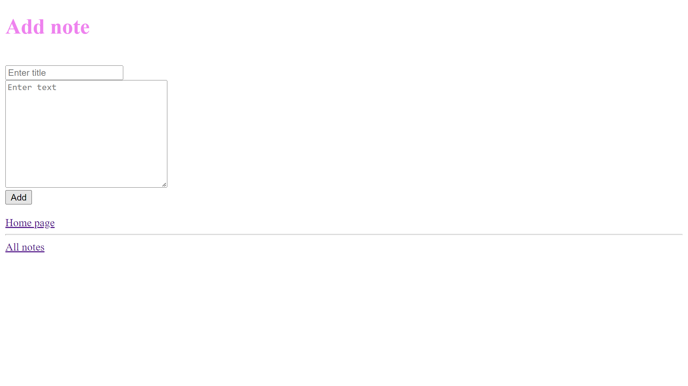

# Notes

Супер простое приложение на node.js с CRUD функционалом, с использованием паттерна MVC.
Проект исключительно учебный.

[Просмотр](https://notes-nodejsapp.herokuapp.com/)

    
    

---

-   Различные манипуляции c данными и сервером:
    **CRUD (create, read, update, delete)**
-   В качестве базы данных использована **MongoDB**
-   Проект написан с учетом паттерна **MVC (model, view, controller)**
-   Стек `Ejs, JavaScript, Node.js, Express.js, MongoDB, Mongoose`
